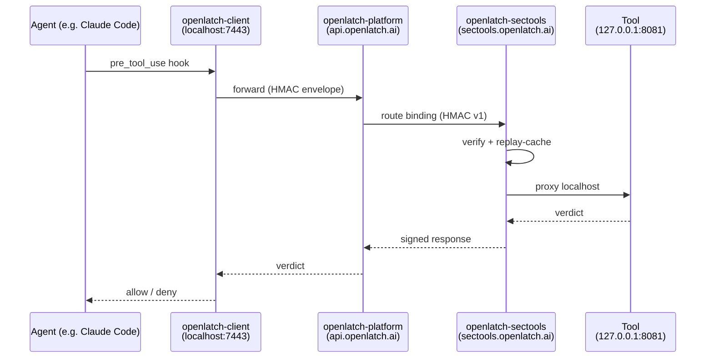
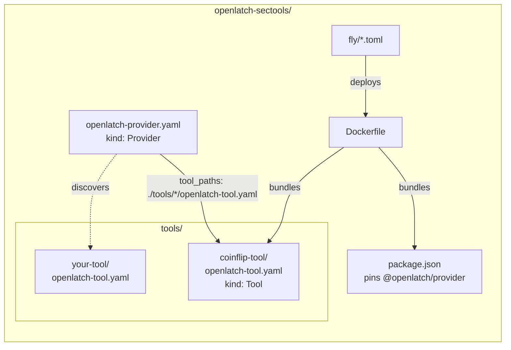
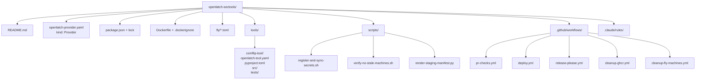

# openlatch-sectools

> **Status — in bootstrap.** This repo depends on the v2 manifest split in [`openlatch-provider`](https://github.com/OpenLatch/openlatch-provider) (the `kind: Tool` + `kind: Provider` + `tool_paths:` design captured in `openlatch-provider/.local/handoff-multi-tool-manifest.md`). Until that ships, the deploy pipeline's `manifest-validate` step will reject the v2 manifests here.

`openlatch-sectools` is the monorepo of security tools authored by OpenLatch Security Researchers and auto-deployed to `sectools.openlatch.ai` as a single connected OpenLatch provider. One Fly app supervises every tool; one push to `main` updates them all. Lift any `tools/<slug>/` directory into its own repo and it stays a valid OpenLatch tool — the SDK is the contract.

- **License**: Apache-2.0
- **Provider domain**: `sectools.openlatch.ai` (production), `sectools-staging.openlatch.ai` (staging)
- **Runtime**: pinned [`@openlatch/provider`](https://www.npmjs.com/package/@openlatch/provider) on a Fly machine, listening on internal `8443` behind Fly TLS
- **Tools**: each under `tools/<slug>/` with its own `openlatch-tool.yaml` (`kind: Tool`, v2)

---

## Architecture

The agent-to-tool round-trip:



What sits in this repo:



The bundled `@openlatch/provider listen` reads the root provider manifest, discovers each per-tool manifest, supervises every tool subprocess, and serves the public webhook endpoint. The OpenLatch platform routes events to it.

---

## Build your first tool locally

You'll run the same image the deploy pipeline runs — minus Fly, plus a synthetic event in place of a real agent hook.

### Prerequisites

| Tool | Why |
| ---- | --- |
| Node.js 22 | Runs the bundled `@openlatch/provider` CLI |
| Python 3.12 + `uv` | The seed coinflip tool (and most future tools) |
| Docker (optional) | If you want to validate the image build locally |

### Five steps to your first verdict

1. **Clone and install the pinned runtime.**

    ```bash
    git clone https://github.com/OpenLatch/openlatch-sectools.git
    cd openlatch-sectools
    npm ci --omit=dev
    ```

2. **Sync the seed tool's Python deps.**

    ```bash
    cd tools/coinflip-tool
    uv sync
    cd ../..
    ```

3. **Start the bundled provider.** It reads `openlatch-provider.yaml`, discovers `tools/coinflip-tool/openlatch-tool.yaml`, spawns coinflip on `127.0.0.1:8081`, waits for `/healthz`, then listens on `0.0.0.0:8443` for inbound webhooks. No TLS in local dev.

    ```bash
    npx openlatch-provider listen \
      --provider openlatch-provider.yaml \
      --no-tls \
      --port 8443
    ```

    On startup, the provider prints each binding's ID. Copy the `bnd_…` for the coinflip binding; you'll use it next.

4. **Fire a synthetic event.** In another terminal:

    ```bash
    npx openlatch-provider trigger pre_tool_use \
      --binding bnd_REPLACE_ME \
      --tool Bash \
      --input 'ls' \
      --no-tls
    ```

    You should see a JSON verdict — either `verdict_hint: deny` (~30 % of the time) or `verdict_hint: allow` (the rest). Tune the deny percent in `openlatch-provider.yaml` under the binding's `process_override.env`.

5. **Tail the audit log** at `~/.openlatch/provider/logs/runtime-<date>.jsonl`. Every processed event lands there as a single JSON line with `event_id`, `binding_id`, `verdict_hint`, `risk_score`, `processing_ms`, and `tool_ms`.

That's the entire feedback loop. Replace `coinflip-tool/` with your own and you have a real security tool.

### Authoring a new tool

See [`.claude/rules/tool-authoring.md`](.claude/rules/tool-authoring.md) for the contract surface (`/healthz`, verdict ≤ 250 KB, latency budget, manifest shape), and [`tools/coinflip-tool/`](tools/coinflip-tool/) as the canonical example to copy.

### Validating without deploying

```bash
# Manifest-validate (no platform mutation)
npx openlatch-provider register --provider openlatch-provider.yaml --dry-run --skip-preflight

# Build the runtime image
docker build -t openlatch-sectools:local .
```

---

## Project layout



---

## Contributing

See [`.github/CONTRIBUTING.md`](.github/CONTRIBUTING.md). Short version: branch off `main`, follow Conventional Commits, ensure `pr-checks.yml` is green, request review, squash-merge.

## Security

See [`SECURITY.md`](SECURITY.md). Report vulnerabilities privately via GitHub Private Reporting or `security@openlatch.ai`.

## License

[Apache-2.0](LICENSE). Tools authored in this repo are licensed under Apache-2.0 unless their own `openlatch-tool.yaml` explicitly says otherwise.
