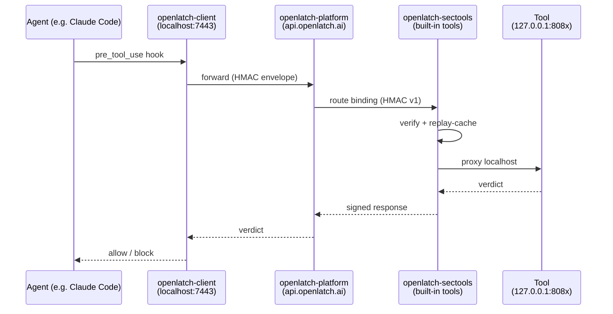
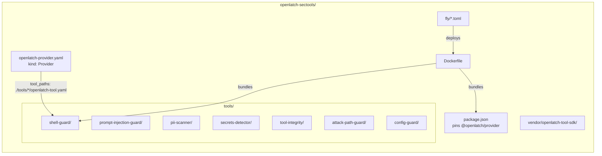
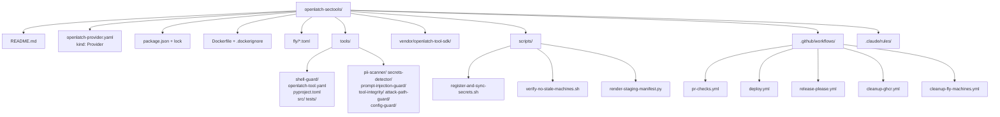

# openlatch-sectools

`openlatch-sectools` is the open-source home of the security tools that ship built-in with the OpenLatch platform — every customer gets them out of the box. They're written against the `openlatch-tool-sdk` (vendored at `vendor/openlatch-tool-sdk/`) and bundled by [`@openlatch/provider`](https://www.npmjs.com/package/@openlatch/provider) — the same runtime any community contributor uses, with no special privileges. We open-sourced them so security researchers can study real detection logic, and so anyone who wants to author their own tool has a clone-and-modify starting point. Lift any `tools/<slug>/` directory into its own repo and it stays a valid OpenLatch tool — the SDK is the contract.

- **License**: Apache-2.0
- **Distribution**: built-in to every OpenLatch deployment — available out-of-the-box to every customer with no installation step
- **Tools**: each under `tools/<slug>/` with its own `openlatch-tool.yaml` (`kind: Tool`, v2)

---

## Tools

Seven first-party tools ship in this repo, all synchronous unless noted:

| Slug | Threat categories | Notes |
| ---- | ----------------- | ----- |
| `pii-scanner` | `pii_outbound`, `pii_inbound` | Presidio-based; opt-in via `OPENLATCH_PII_SCANNER_PRESIDIO=1` |
| `secrets-detector` | `credential_detection` | Regex + entropy heuristics |
| `shell-guard` | `shell_dangerous`, `shell_exfiltration` | Pure-Python, deterministic; e.g. `rm -rf /` → block `SHELL-RM-ROOT-01` |
| `prompt-injection-guard` | `injection_user_input`, `injection_tool_response` | Regex prefilters always-on; optional deberta model via `OPENLATCH_PROMPT_INJECTION_GUARD_MODEL=1` (lazy, not baked into image) |
| `tool-integrity` | `tool_poison_detection`, `tool_typosquatting`, `tool_hash_verification` | Stateful — reads `event.prior_config_state` |
| `attack-path-guard` | `attack_path_analysis` | **async**, 5000 ms declared p95 budget |
| `config-guard` | `configuration_threat` | Stateful — reads `event.prior_config_state` and raw payload |

Each tool reads its own `OPENLATCH_<SLUG_UPPER>_PORT` env var to override its listen port (defaults in the table below match the manifests).

---

## Architecture

The agent-to-tool round-trip:



What sits in this repo:



The bundled `@openlatch/provider listen` reads the root provider manifest, discovers each per-tool manifest, supervises every tool subprocess, and serves the public webhook endpoint. The OpenLatch platform routes events to it.

---

## Build your first tool locally

You'll run the same image the deploy pipeline runs — minus Fly, plus a synthetic event in place of a real agent hook. `shell-guard` is the canonical template tool: pure-Python, deterministic, no optional extras.

### Prerequisites

| Tool | Why |
| ---- | --- |
| Node.js 22 | Runs the bundled `@openlatch/provider` CLI |
| Python 3.12 + `uv` | Required by all Python tools |
| Docker (optional) | If you want to validate the image build locally |

### Five steps to your first verdict

1. **Clone and install the pinned runtime.**

    ```bash
    git clone https://github.com/OpenLatch/openlatch-sectools.git
    cd openlatch-sectools
    npm ci --omit=dev
    ```

2. **Sync shell-guard's Python deps.**

    ```bash
    cd tools/shell-guard
    uv sync
    cd ../..
    ```

3. **Start the bundled provider.** It reads `openlatch-provider.yaml`, discovers each `tools/*/openlatch-tool.yaml`, spawns all tools on their respective `127.0.0.1` ports, waits for `/healthz` on each, then listens on `0.0.0.0:8443` for inbound webhooks. No TLS in local dev.

    ```bash
    npx openlatch-provider listen \
      --provider openlatch-provider.yaml \
      --no-tls \
      --port 8443
    ```

    On startup, the provider prints each binding's ID. Copy the `bnd_…` for the shell-guard binding; you'll use it next.

4. **Fire a synthetic event.** In another terminal:

    ```bash
    npx openlatch-provider trigger pre_tool_use \
      --binding bnd_REPLACE_ME \
      --tool Bash \
      --input 'rm -rf /' \
      --no-tls
    ```

    You should see a JSON verdict: `verdict_hint: block`, `rule_id: SHELL-RM-ROOT-01`. Try `--input 'ls'` to see an `allow` verdict.

5. **Tail the audit log** at `~/.openlatch/provider/logs/runtime-<date>.jsonl`. Every processed event lands there as a single JSON line with `event_id`, `binding_id`, `verdict_hint`, `risk_score`, `processing_ms`, and `tool_ms`.

That's the entire feedback loop. Copy `tools/shell-guard/` as your starting point for a new tool.

### Authoring a new tool

See [`.claude/rules/tool-authoring.md`](.claude/rules/tool-authoring.md) for the contract surface (`/healthz`, verdict ≤ 250 KB, latency budget, manifest shape, SDK vendoring, stateful-detector pattern, ML extra rules).

### Validating without deploying

```bash
# Manifest-validate (no platform mutation)
npx openlatch-provider register --provider openlatch-provider.yaml --dry-run --skip-preflight

# Build the runtime image
docker build -t openlatch-sectools:local .
```

---

## Project layout



---

## Contributing

See [`.github/CONTRIBUTING.md`](.github/CONTRIBUTING.md). Short version: branch off `main`, follow Conventional Commits, ensure `pr-checks.yml` is green, request review, squash-merge.

## Security

See [`SECURITY.md`](SECURITY.md). Report vulnerabilities privately via GitHub Private Reporting or `security@openlatch.ai`.

## License

[Apache-2.0](LICENSE). Tools authored in this repo are licensed under Apache-2.0 unless their own `openlatch-tool.yaml` explicitly says otherwise.
